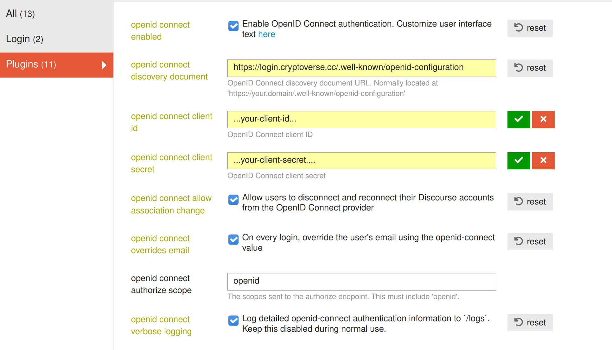
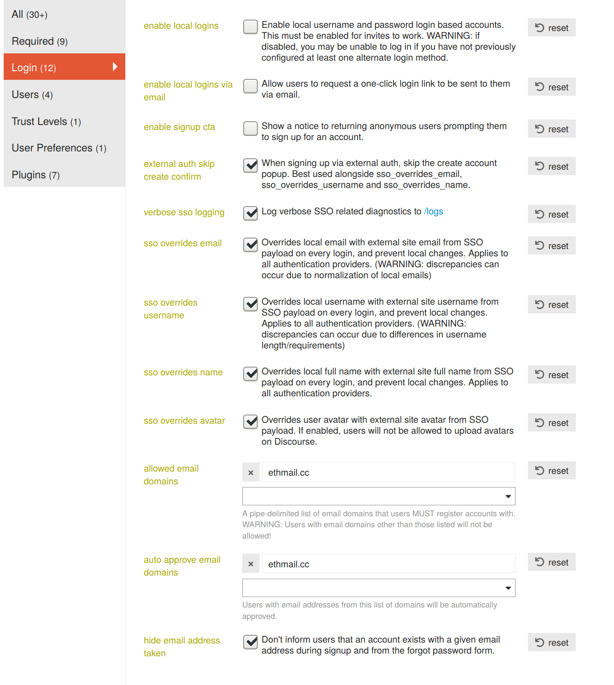

# Configure Discourse with Cryptoauth

## Ask for Client ID and Client Secret

To be able to use cryptoauth with your discourse instance you need client ID and client Secret.
Feel free to send email to xunkulapchvatal@ethmail.cc, reach out on twitter @xunkulapchvatal or use built-in chat on

## Recommended settings

Not all are necessary for login to work.

Discovery document url: https://auth.cryptoverse.cc/.well-known/openid-configuration

